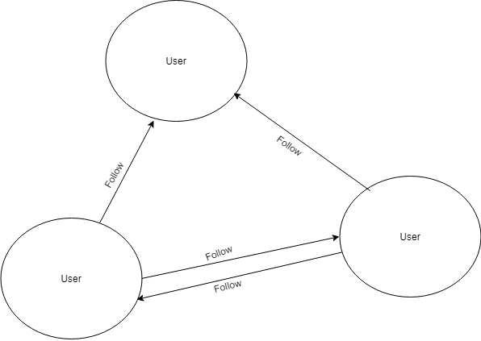
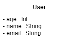

<h2 align="center">Social Graph</h2>
<ol>
	<h3>About</h3>
	<li>Social graph implemented in Java (To do)</li>
	<li>To do</li>
	<li>To do</li>
	<li>To do</li>	
</ol>

<ol>
	<h4>Building Instruction</h4>
	Do the following steps
	<li><strong>git clone 'https://github.com/UbaidurRehman1/SocialNetworkNeo4j.git'</strong></li>
	<li><strong>cd SocialNetworkNeo4j</strong></li>
	<li><strong>mvn clean compile assembly:single</strong></li>
	<li>cd target</li>
	<li><strong>java -jar  SocialGraph-0.0.1-SNAPSHOT-jar-with-dependencies.jar</strong> to run the jar</li>
</ol>
<ol>
	<h4>Requirements</h4>
	<li>Java JDK 12 (required)</li>
	<li>Apache MAVEN 3.6.1 (required)</li>
	<li>set JAVA_HOME variable (optional)</li>
	<li>set MAVEN_HOME (optional)</li>
</ol>

<ol>
	<h4>UML Specs [Very First Prototype]</h4>
	<li>
		<h4>Flow Diagram of Graph<h4>
		

			</img>
		

	</li>
	<li>
		<h4>UML diagram of User</h4>
		

			</img>
		

	</li>
</ol>
